# 構成図
comming soon...

# 構築手順
## ドメイン登録
ref.
https://note.com/dafujii/n/n12bb564081f1
https://note.com/dafujii/n/n0365dc0a89af

### freenomでドメイン取得
適当に画面入力してドメインを取得。
無料枠最大の12ヶ月で取得。更新も無料。

### Route53でホストゾーンの作成
`ホストゾーンの作成` に進み、freenomで取得したドメイン名を入力する。

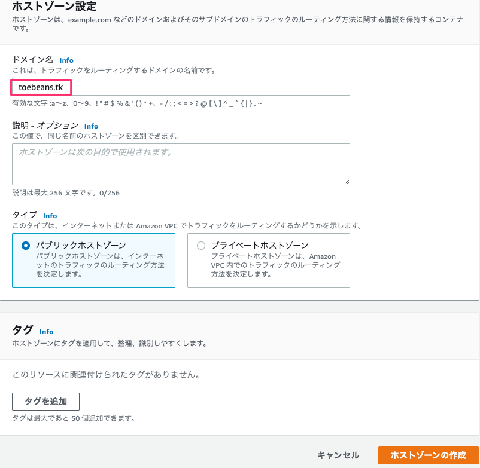

### freenomでレコード設定
`Services > My Domains > Manage Domain > Manage Freenom DNS > Edit Nameservers > Use custom nameservers (enter below)` と進む。

Route53で払い出されたNSレコードの値4つを入力する。登録後、自動で大文字になる。

`Change Nameservers` を押す。

## メールサーバ構築
### ドメイン検証とレコード設定
SESコンソールの `Domains` の `verify a New Domain` を押す。
freenomで取得したドメイン `toebeans.tk` を入力して、 `Generate DKIM Settings` にチェックして、 `Verify This Domain` を押す。
 
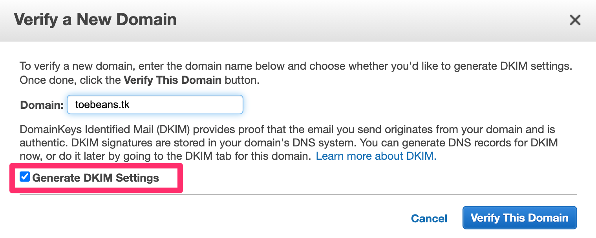
 
ポップアップが表示されるので、 `Use Route53` を押す。

`Email Receiving Record`にチェックを入れ、`Create Record Sets` ボタンを押す。

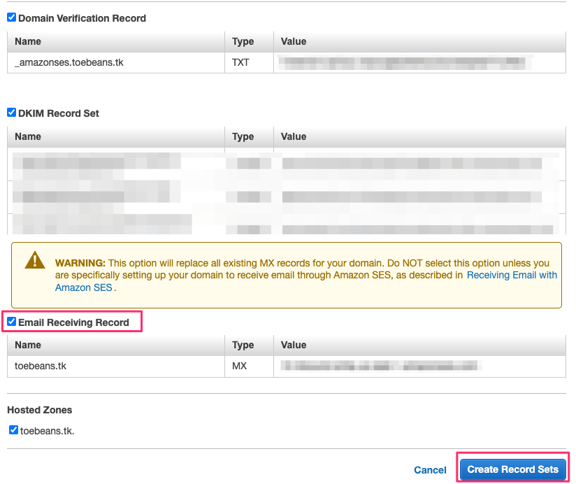

### ドメイン有効確認
有効になっていることを確認する。72時間以内に有効となるらしいが、たいていは数分以内で完了する。ただし、DKIMだけ一時間ほどかかるかも。

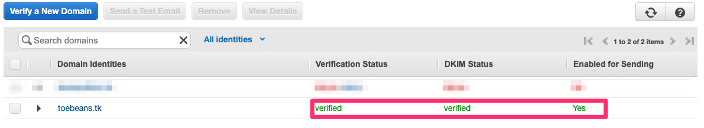

### メール送信テスト
`Email Addresses > Verify a New Email Address` で適当なメールアドレスを入力し、検証する。

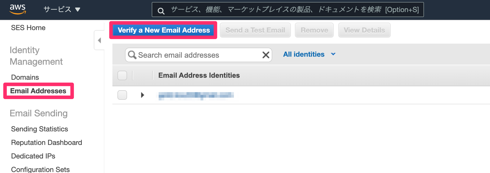

メールのテスト送信をする。さきほど検証したメールアドレスを送信先に指定する。

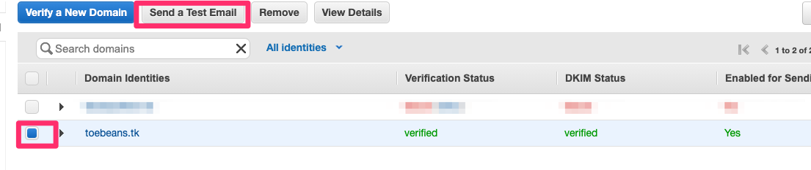

### sandboxから抜ける
SESは作成時点ではsandboxのまま。
このままでは検証されたメールに対してのみにしか送信できないため、sandboxから抜けるための申請が必要。

`Email Sending > Sending Statistics > Edit your account details` と進む。

`Enable production access` をYesにして申請内容を適当に埋める。今回は、ユーザ登録機能にメール送信が必要なので、Sandoxから抜けたいです的なことを拙い英語で書いた。

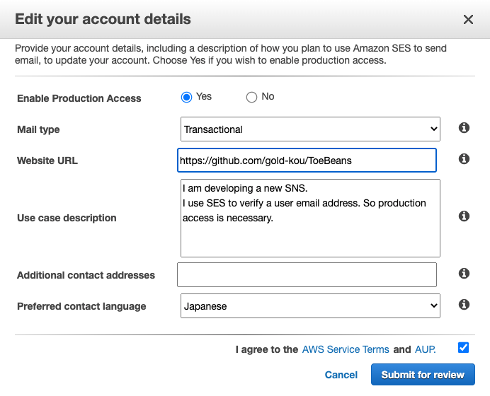

ref. https://docs.aws.amazon.com/ses/latest/DeveloperGuide/request-production-access.html

## Terraform
### 前提
Terraformインストール済み。

### IAMユーザ作成
AWSコンソールにてTerraform実行用のユーザをコンソールで作成する。

### クレデンシャル設定
```
$ vi ~/.aws/credentials
[terraform]
aws_default_region=ap-northeast-1
aws_access_key_id=XXXXX
aws_secret_access_key=XXXXX
```

### tfstate管理用バケットの作成
AWSコンソールにてS3バケットを作成する。「パブリックアクセスをすべてブロック」・「バージョニングを有効」・「暗号化を有効」で作成する。

バケット名は、 `main.tf` のbucketと一致させる。

### GitHubとAWSの連携設定
`AWS Connector for GitHub` を設定する。

（手順詳細忘れた）。

### SSHキーペアの作成
`ssh-keygen -t rsa -f toebeans -N ''` とかだった気がする。

### GitHubトークンの生成
GitHubコンソールの `Settings > Developer Settings > Personal access tokens` と進む。
新規の場合は、 `Generate new token` を押す。 `Select scopes` では `repo` と `admin:repo_hook` を全てチェック。
再発行の場合は、 `Regenarate token` を押す。

## SSMパラメータストアの設定
`cotainer_definitions.json` の `secrets` の内容を設定する。

`github_token` に関してはapply前に設定が必須。

`google_api_key` の値は `$ cat backend/secret/service-account.json | tr -d '\n'` の実行結果からスペースを全て削除したものを設定する。

### apply
```
$ cd environments/prd
$ AWS_PROFILE=terraform GITHUB_TOKEN=xxx terraform apply -auto-approve
```

以下のエラーが発生した場合は、少し時間を置いてから再applyする。
// TODO depends_on使えば回避できるかもしれない。

```
Error: error creating ELBv2 Listener (arn:aws:elasticloadbalancing:ap-northeast-1:022111582403:loadbalancer/app/toebeans/460be5df191fb445): UnsupportedCertificate: The certificate 'arn:aws:acm:ap-northeast-1:022111582403:certificate/77af2cb4-5d0e-4359-812e-02119b9f32f7' must have a fully-qualified domain name, a supported signature, and a supported key size.
```

## CodeStar接続
初回apply時はCodePipelineの実行に失敗してしまうため、以下の手順で再開する。

接続の項目から対象のコネクションを選択する。
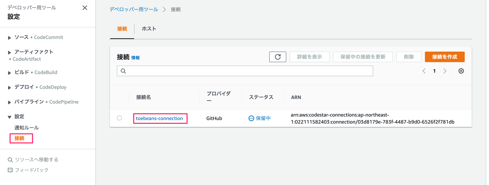

`保留中の接続を更新` を押す。
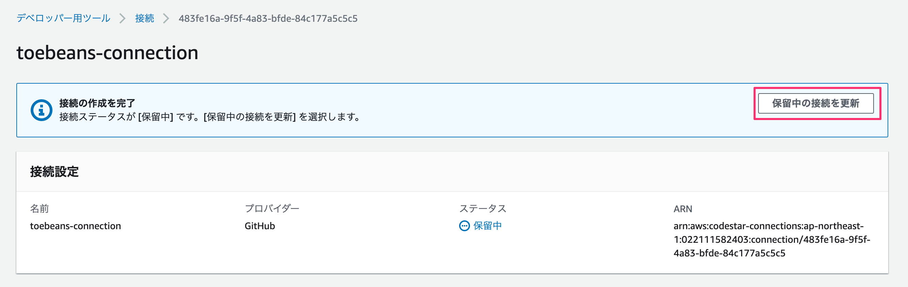

GitHubアプリで自分のアカウントを選択し、 `接続` を押す。
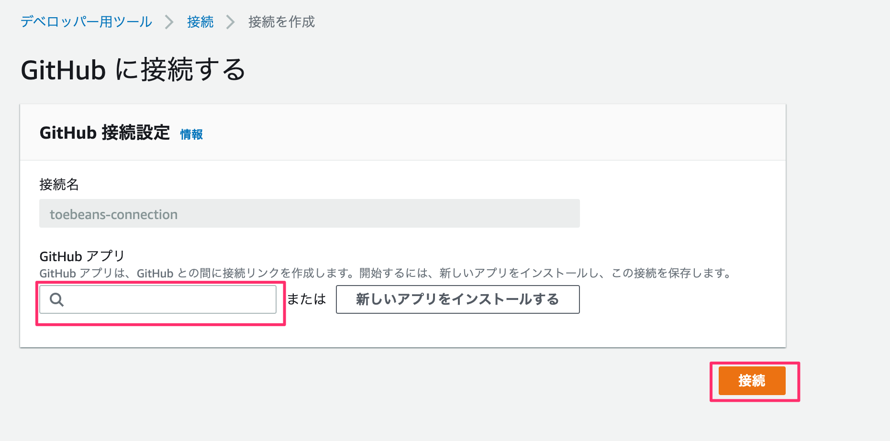

対象のパイプラインを選択し、 `変更をリリースする` を押す。

## RDSパスワード変更

## DBマイグレーション
踏み台サーバにログインする。

`mysql -u admin -p -h <RDSエンドポイント>` を実行する。RDSエンドポイントはコンソールの `接続とセキュリティ` から確認可能。

`CREATE DATABASE toebeansdb DEFAULT CHARACTER SET utf8;` を実行する。

`USE toebeansdb;` を実行する。

`backend/toebeans-sql/mysql/sql/001_create_tables.sql` の内容を実行する。

## CloudFront修正
`cycle error` によりACMをTerraformのコード上で指定できない都合上、コンソールで設定の追加をする必要がある。設定後数分で403 Errorでなくなる。

- 代替ドメイン名を追加してtoebeans.tkを入力する
- カスタムSSL証明書でバージニアのものを選択する

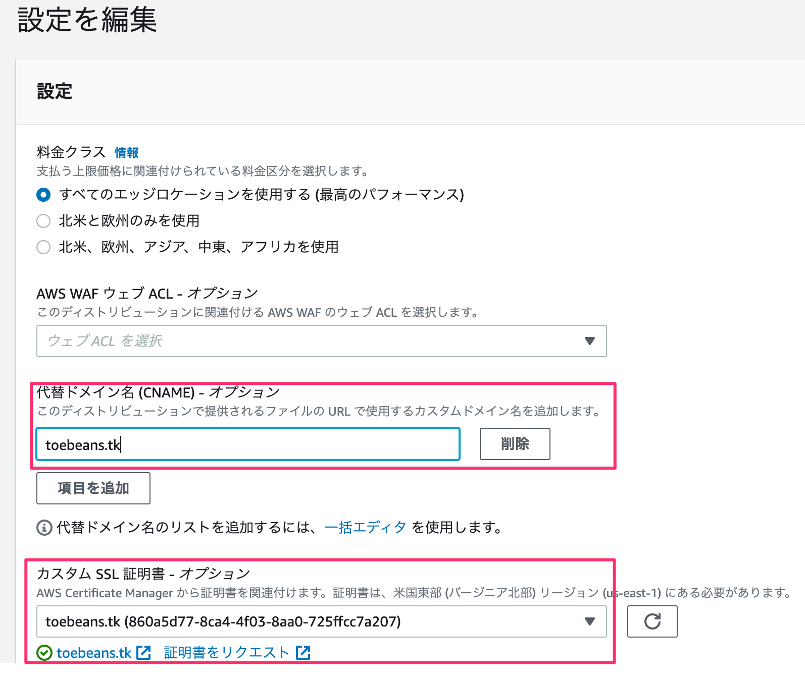

※Terraformのコード上で `cloudfront_default_certificate = true` としているめ、applyされるたびに本設定をやり直す必要がある。

## S3へフロントのソースコードをアップロード
`frontend/` に移動。

`npm run build` を実行する。

`build` ディレクトリ配下のファイルとディレクトリをS3へアップロードする。buildディレクトリ自体はアップロードしないように注意する。
