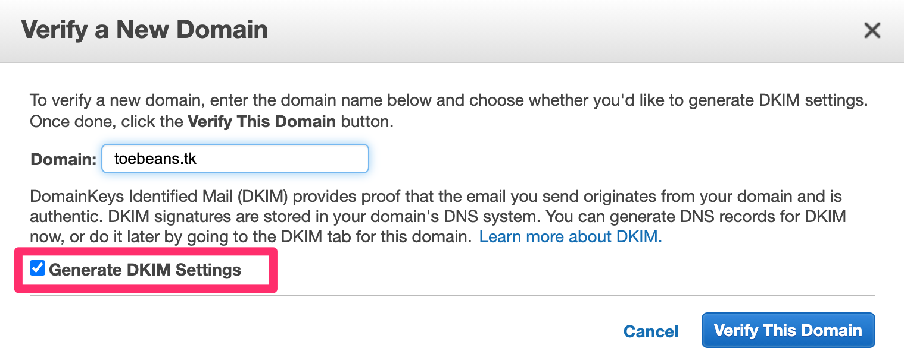

# ドメイン取得とSES設定
## step1. freenomでドメイン取得
適当に画面入力してドメインを取得。
無料枠最大の12ヶ月で取得。更新も無料。

## step2. SES
SESコンソールのDomains画面で verify a New Domain を押す。
freenom で取得したドメインを入力して、 Generate DKIM Settings にチェックして、 Verify This Domain を押す。
 

 
※表示されたレコードは次のステップで使用する。
 
## step3. freenomでレコード設定
Manage freenom DNS を押す。

Use default nameservers(Freenom Nameservers)を選択する。

前ステップで取得したTYPEがTXTのレコード１件と、TYPEがCNAMEのレコード３件を登録する。

## step4. ドメイン有効確認
有効になっていることを確認する。有効になるには数時間以上かかるかも。

## step5. メール送信テスト
Email Addresses > Verify a New Email Address でメールアドレスを検証する。

メールのテスト送信をする。さきほど検証したメールアドレスを送信先に指定する。

## step6. sandboxから抜ける
SESは作成時点ではsandboxのままである。
このままでは検証されたメールに対してのみにしか送信できないため、sandboxから抜けるための申請をする。

Email Sending > Sending Statistics > Edit your account details

Enable production access を Yes にして申請内容を適当に埋める。ユーザ登録機能にメール送信が必要なので、Sandoxから抜けたいです的なことを書きました。

ref. https://docs.aws.amazon.com/ses/latest/DeveloperGuide/request-production-access.html